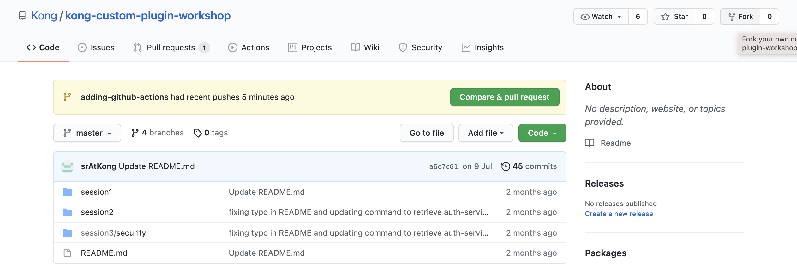
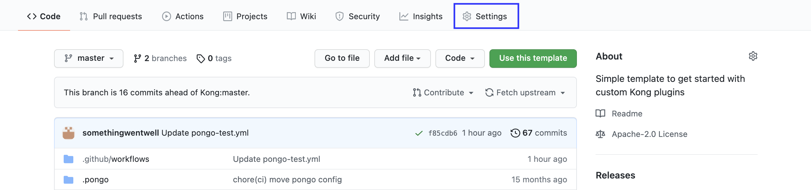
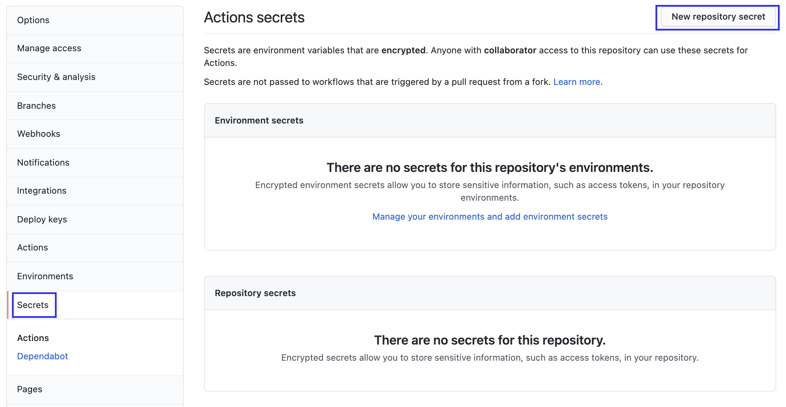
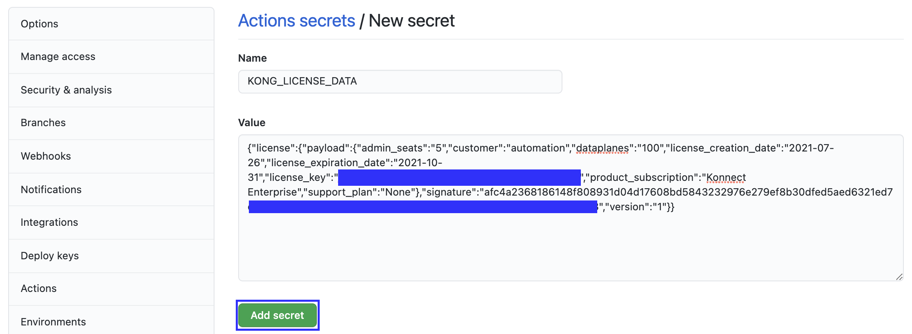
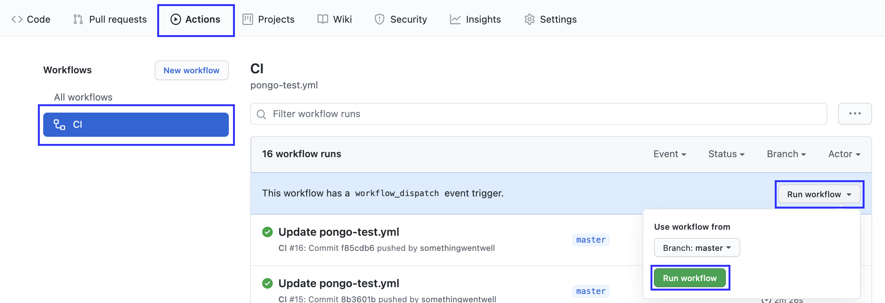
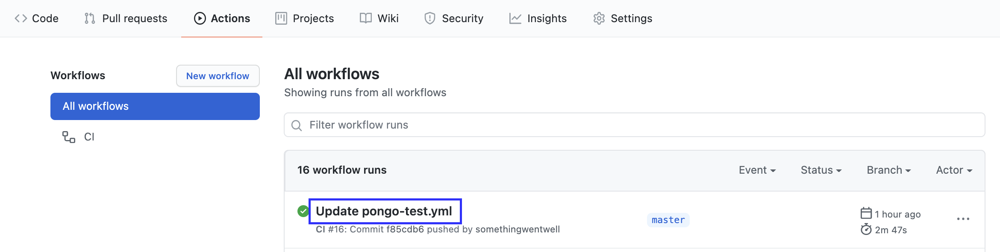
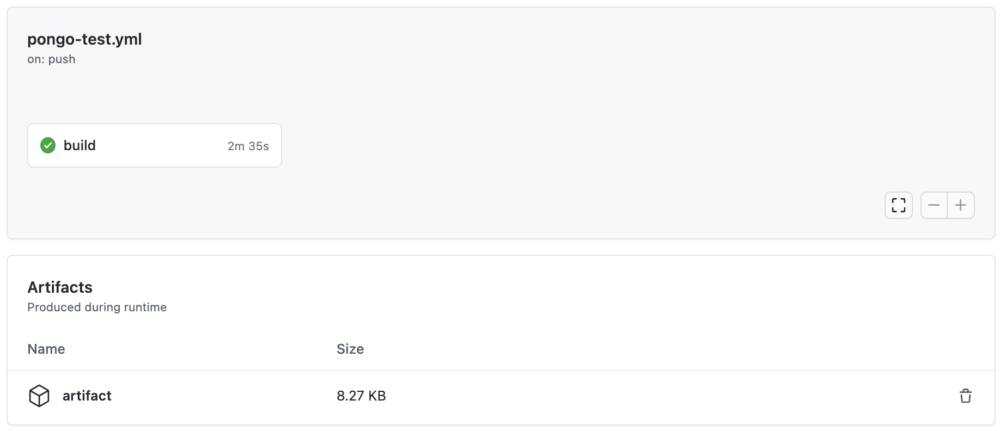
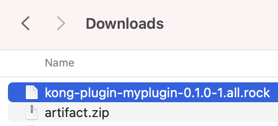

## Introduction

このラボでは、CIパイプラインでカスタムプラグインをテストし、LuarockバイナリをビルドしてGitHub Artifactsに自動的にアップロードするためのGitHub Actionsワークフローを作成します。

## Fork the repo

リポジトリの右上にある "Fork" をクリックします

## GitHubシークレットとしてライセンスデータを追加する（オプション）

Forkしたリポジトリの "Setting"をクリックします。

左サイドバーの "Secrets" をクリックし、"New repository secret"をクリックします。

"KONG_LICENSE_DATA"という名前でシークレットを作成し、値にライセンスデータを入力します。 その後"Add secret"をクリックします。

Comment line 17 and uncomment line 18 & 19.

## Run workflow

手動でワークフローを実行するには、"Actions"タブをクリックし、"All workflows"の下にある"CI"を選択し、"Run workflow"をクリックします。

または、masterブランチにプッシュしてコミットすると、ワークフローが自動的に実行されます。

## 結果の確認

パイプライン実行後、ワークフローをクリックします。

Artifactがあるはずなので、それをダウンロードします。

ダウンロード物を解凍し、rockファイルがあることを確認します。
